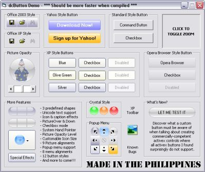



## dcButton ActiveX Control \- First Public Release\!

### Description

2nd UPDATED!!! Still working on other issues. New and improved button styles. Fast and efficient control. Good icon/picture handling. Heavy API usage. Rare/uncommon button events aware. Unicode text support. Popup menu support. Single-file'd ownerdrawn usercontrol. Lite &amp; full versions supplied. Fully optimized &amp; flexible codes. Very well commented. Compile ready. For advance &amp; novice users. Coding history provided. In-file code links. Should work on Windows 95 or later (Based on API requirements). Free for use by everyone. No registration required. Comments/suggestions appreciated. Votes valued. Donations/promotions welcome. Made in the Philippines!
 
### More Info
 

             |
---                |---
**Submitted On**   |2006-07-28 05:41:52
**By**             |[Noel Dacara](https://github.com/Planet-Source-Code/PSCIndex/blob/master/ByAuthor/noel-dacara.md)
**Level**          |Advanced
**User Rating**    |5.0 (254 globes from 51 users)
**Compatibility**  |VB 5\.0, VB 6\.0
**Category**       |[Custom Controls/ Forms/  Menus](https://github.com/Planet-Source-Code/PSCIndex/blob/master/ByCategory/custom-controls-forms-menus__1-4.md)
**World**          |[Visual Basic](https://github.com/Planet-Source-Code/PSCIndex/blob/master/ByWorld/visual-basic.md)
**Archive File**   |[dcButton\_A2009227282006\.zip](https://github.com/Planet-Source-Code/noel-dacara-dcbutton-activex-control-first-public-release__1-65941/archive/master.zip)

